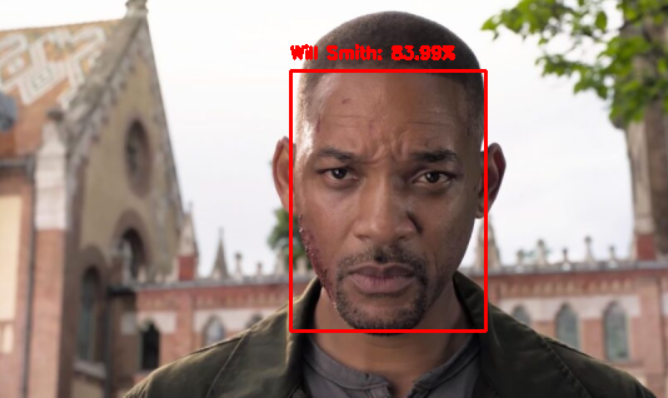
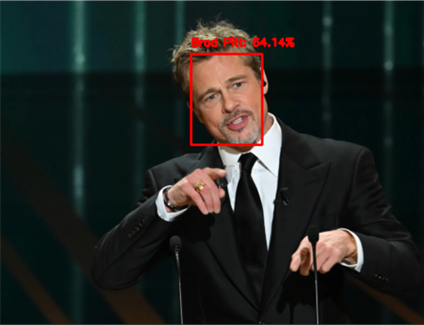
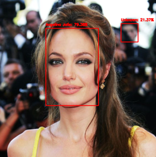
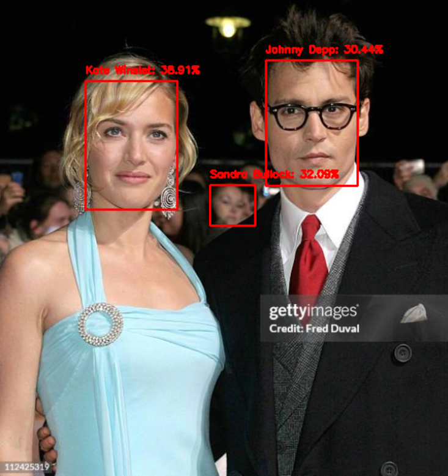
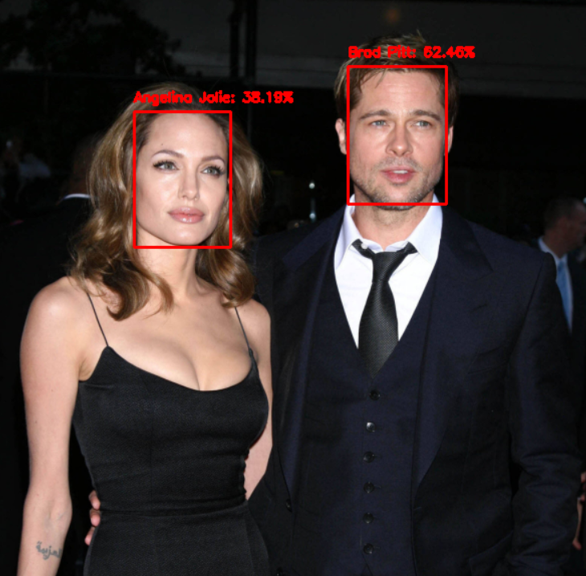

# Projet de Reconnaissance Faciale avec OpenCV

## Description
Ce projet implémente un système de reconnaissance faciale en temps réel en utilisant la bibliothèque OpenCV. L'application est capable de détecter et de reconnaître des visages à partir d'un flux vidéo ou d'images enregistrées. Le modèle utilise un détecteur de visages, un extracteur d'empreintes faciales et un classificateur pour associer les visages à des identités connues.

## Exécution
Exécuter la commande suivante en remplaçant [nom de l'image] par le fichier image à tester : `python recognize.py --detector face_detection_model --embedding-model openface_nn4.small2.v1.t7 --recognizer output/recognizer.pickle --le output/le.pickle --image images/[nom de l'image]`

Pour effectuer la reconnaissance faciale en temps réel depuis une caméra: `python recognize_video.py --detector face_detection_model --embedding-model openface_nn4.small2.v1.t7 --recognizer output/recognizer.pickle --le output/le.pickle`

## Résultats
Voici quelques exemples de détection et de reconnaissance faciale obtenus avec ce projet :

